# About This Edition

This manual was originally written by Rune Mark Hansen (credited in the program as Rune Mark Glendorf, RMG Engineering,
<https://rmg-engineering.com/>) and released with the program's source code. This community edition belongs to
OpenRMH-IRCAM, the community build of IRCAM Thermal Viewer 3.0.0. It differs from the original manual as follows:

- The software licensing and activation sections and the proprietary Terms of Use are removed. They applied to the
  earlier commercial release; this program is free and has no licence key or trial mode. For the same reason a
  licence-check status message is painted out of one screenshot (section 4.9).
- The supported camera list is updated to the camera list of version 3.0.0.
- The MATLAB examples are the versions in the source repository (`examples/matlab/`).
- Settings added since the original manual are described, and small corrections are made.

The screenshots come from the original manual and show an earlier version of the program (2.0). The 3.0.0 layout
is the same except where this text says otherwise.

**Licence.** This manual is distributed under the same MIT licence as the software (see `LICENSE` in the source
repository): Copyright (c) 2022-2026 Rune Mark Hansen, Copyright (c) 2026 Cyclotronic. Product names mentioned are
trademarks of their respective owners.

**Questions and problems.** Report issues at <https://github.com/Cyclotronic/OpenRMH-IRCAM/issues>.

# 1.0 – Introduction

IRCAM Thermal Viewer, is an Infrared Thermal Camera Analysis software, for use in applications such as Temperature Monitoring, Thermal Inspection, Electronics Repair, Scientific Research, Electronics R&D and much more. The software includes many advanced features, with more being added continuously – Perfect for any thermal analysis application.

The software was written and developed to be used with the InfiRay series of thermal cameras, but support for any UVC thermal camera can be added, to enable the software to be used with a large selection of thermal cameras from different brands.

There are many High-End thermal cameras on the market, especially coming from the Chinese market. These cameras offer very impressive specifications, and for an affordable price. Some of these cameras even rival or outperform many of the well-known brand thermal cameras, and for a fraction of the price.

The downside of buying such a camera, is that almost all of these cameras, are lacking some kind of analysis software for PC. The majority of the cameras, are limited by the functionality of a specific manufacturer written Android or IOS app, which heavily limit the usability and functionality of such capable thermal cameras.

If more advanced features, functionality and a capable PC software is needed, then only well-known brand thermal cameras offer such a solution – but for a price no private person or small business could Justify paying for monthly - and with limitations on the physical camera specifications, due to restrictions on the European and American market.

This is where IRCAM Thermal Viewer comes in. IRCAM Thermal Viewer is developed by a Danish electronics engineer, with a passion for thermal imaging. This software is the much-needed PC analysis software, which finally unlocks the potential of a vast selection of thermal cameras available on the market. The software features a large selection of advanced features.

## 1.1 – Software Application Overview

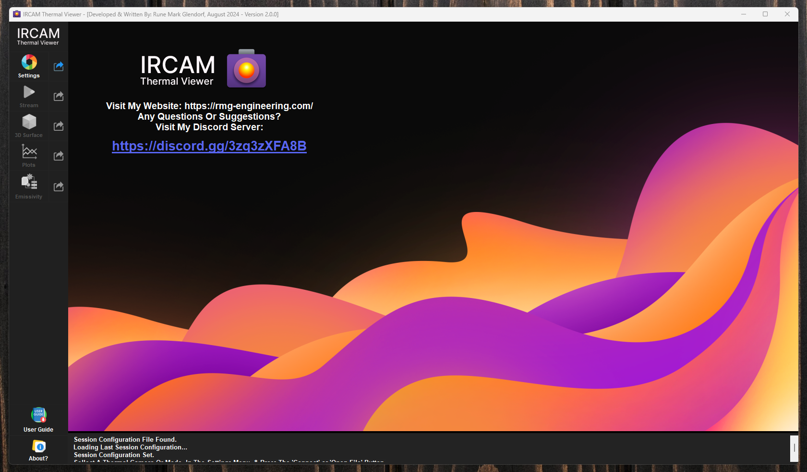

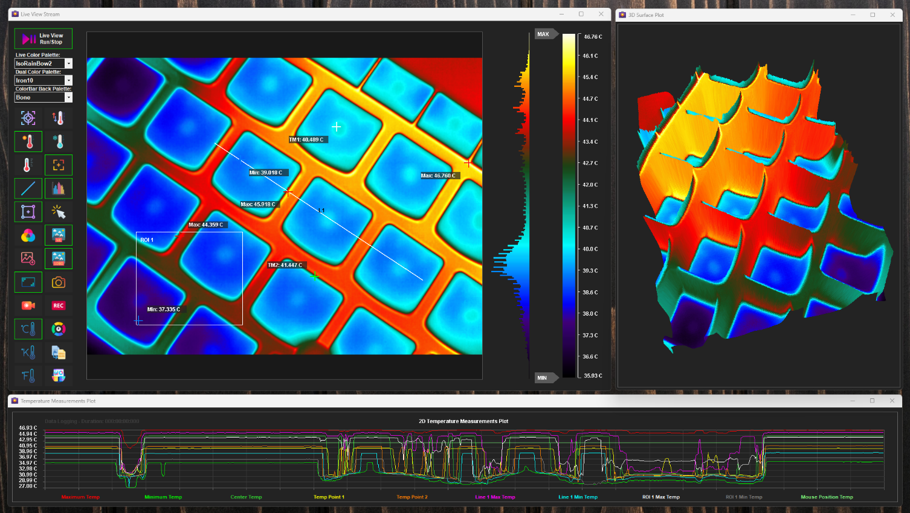

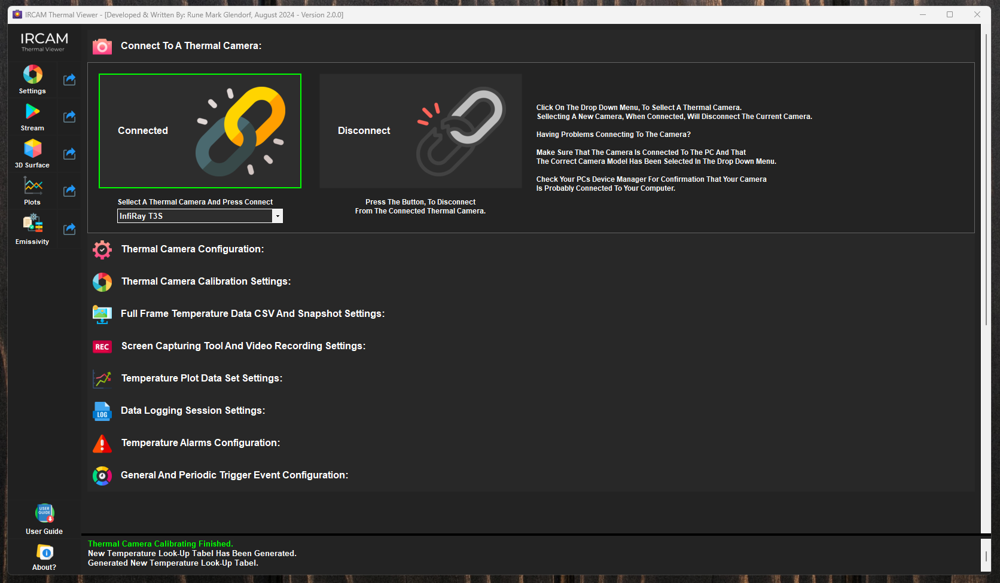

# 2.0 – Supported Thermal Cameras

Version 3.0.0 lists the following thermal cameras in the camera drop-down menu (section [3.1 – Connecting To A Thermal Camera](#31--connecting-to-a-thermal-camera)). Select the entry that exactly matches your camera: several models register with Windows under the same generic name, so the program relies on the entry you choose to know how to read the camera.

- InfiRay T2L, and InfiRay T2L V2

- InfiRay T2-Search, and InfiRay T2-Search V2

- InfiRay T2S+, and InfiRay T2S+ V2

- InfiRay T2Pro And T2SPro, and InfiRay T2Pro And T2SPro V2

- InfiRay T3-Search

- InfiRay T3S

- InfiRay T3Pro

- InfiRay P2

- InfiRay Or Thermal Master P2Pro

- InfiRay DV-DL13

- InfiRay S0 Series

- InfiRay Tiny1-C (Cores And Cameras With Core)

- Thermal Master P2 (a separate entry from the InfiRay P2 and from the P2Pro)

- HTI HT-301

- UNI-T UTi260M

- TOPDON TC001 or TS001

- TOPDON TC002 or TC003

- Victor 328B

- LODESTAR L2

The same drop-down menu also holds the two analysis modes, "Snapshot Analysis Mode" and "Recording Analysis Mode" (sections [10.0](#100--recording-analysis-mode) and [11.0](#110--snapshot-analysis-mode)).

If your thermal camera is not on the list, open an issue in the source repository with the camera model and the device name Windows shows for it in Device Manager (under *Cameras*).

# 3.0 – Software User Manual & Feature Guide

The following sections describes the different software features and how to use them within the IRCAM software environment.

## 3.1 – Connecting To A Thermal Camera

When the software application opens, the start screen will be in front.

- Click on the button “Settings” in the left menu panel of the application software.


- The different camera settings & setup menu’s will be shown, with the menu “Connect To A Thermal Camera” already open.

- Select your thermal camera from the drop-down menu.

- Press the “Connect” button to connect to the thermal camera.

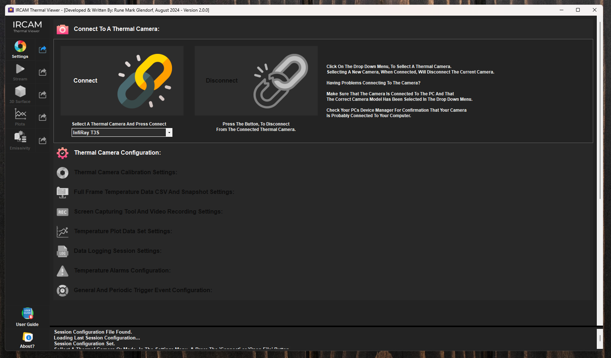

- When the thermal camera has been successfully connected, the button will indicate a connected state. Additional camera information will be displayed in the message panel, in the bottom of the application.

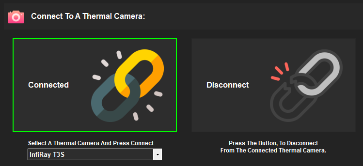

- If the camera was not detected, or an issue with connecting to the camera occurred, the button will indicate an error state. Pressing the button again, will restart the connection process.

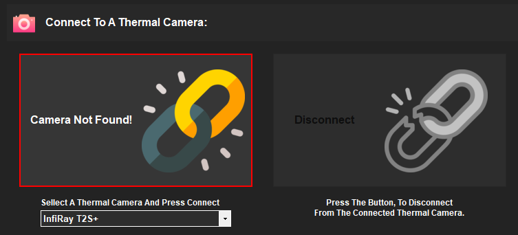

## 3.2 – Thermal Camera Configuration

The “Thermal Camera Configuration” menu, displays the current camera configuration.

The configuration parameters can be changed to different values, depending on the desired camera and temperature configuration. To enable a new configuration, press the “Set Configuration” button. To read the current camera configuration, press the “Read Camera Configuration” button. Press the Recover button to revert back to the default values.

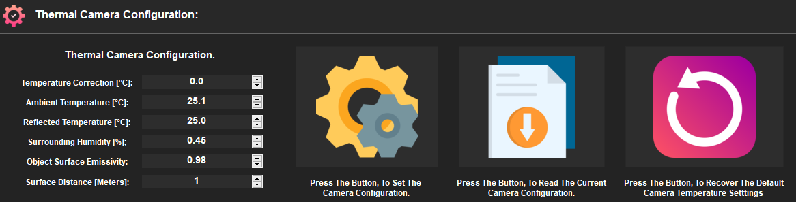

**<u>Temperature Correction:</u>** Is a temperature offset value, which will be added to any temperature measurement.

**<u>Ambient Temperature:</u>** Is the thermal cameras ambient environment temperature (Typically 25ºC).

**<u>Reflected Temperature:</u>** Is the thermal radiation from other environment objects, reflected off the target object.

**<u>Surrounding Humidity:</u>** Is the thermal cameras surrounding environmental humidity in percent. Where 1.0 is 100%.

**<u>Object Surface Emissivity</u>**: Is the ratio of radiated energy from the target’s material surface, to that radiated from a perfect black-body object. An emissivity value of 1, means a perfect black-body object.

**<u>Surface Distance:</u>** Is the distance from the thermal camera, to the target object in meters.

## 3.3 – Thermal Camera Calibration Settings

The “Thermal Camera Calibration Settings” menu, is used to configure automatic camera interval calibration and to read the thermal camera’s internal Detector, Core and Shutter temperatures. The internal temperatures are used in temperature calculations, and can be read by clicking the sub-menu button.

For automatic or temperature drift automatic camera calibration, select a calibration period or maximum drift temperature and press the button to enable the auto calibration feature. A timer or monitor will perform a camera sensor calibration at the end of each configured period or if the cameras drift temperature goes above the set point. To disable auto calibration, press the associated button again.

Automatic calibration is useful in long monitoring sessions, where the cameras internal temperatures will drift and affect the temperature measurements precision. By enabling the automatic calibration feature, will ensure that long term temperature measurements are always precise.

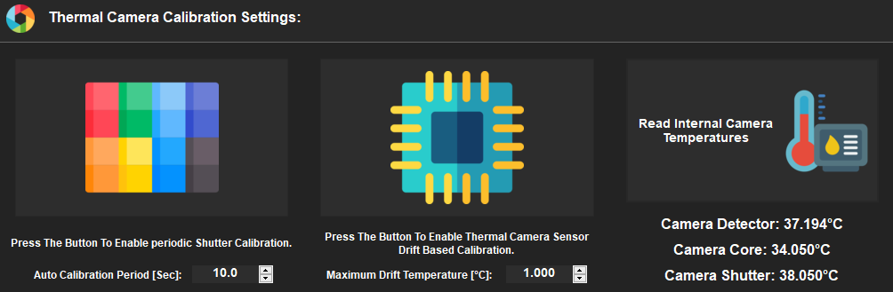

## 3.4 – Full Temperature Frame Data CSV And Snapshot Settings

The “Full Temperature Frame Data CSV And Snapshot Settings” menu, configures the options for the live view snapshot and full temperature frame data features.

The snapshot and temperature frame data settings are:

- Configure the default save file location for every saved live view snapshot and full frame temperature data CSV file.

- Toggle the inclusion of the entire Live View Panel in the saved snapshot – Live View panel is included by default.

- Enable saving of a RAW thermal sensor output data snapshot (14Bit Full-Scale Range) - to a PNG format (RGB24).

- Select the desired Full Frame Temperature Data CSV delimiter character.

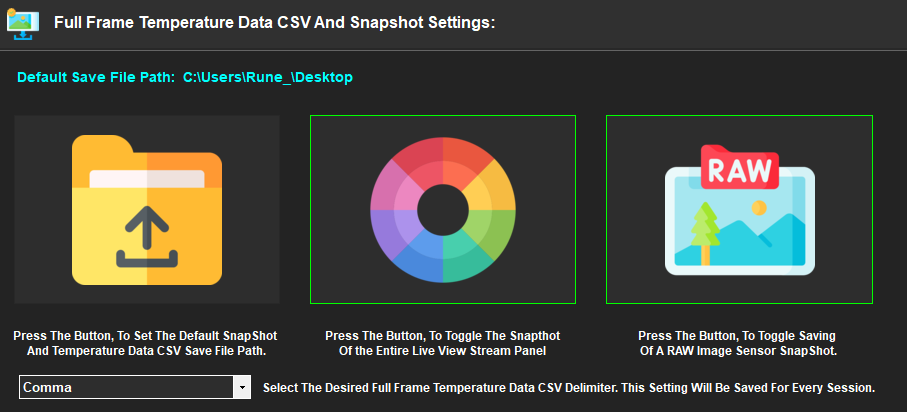

## 3.5 – Screen Capturing Tool And Video Recording Settings

The “Screen Capturing Tool And Video Recording Settings” menu, enables the user to choose a screen capturing tool or configure the capturing of RAW thermal data for use in recording analysis mode.

Windows already has very capable tools build-in. These tools are perfect for capturing screen-shots or live video from the application.

IRCAM Thermal Viewer can also record .avi video directly from the application and capture/record in a RAW format, which is used for post-processing/analysis of recorded data in “Recording Analysis Mode”.

In the menu, the user can select the default save file path for the recorded .avi and RAW video files. Two options for a screen capturing tool are provided, and the user can select one to be opened when pressing the associated button in the Live View Tools panel. The last button can be toggled to enable the saving of a recorded .avi RAW video file. This file is used to analyse recorded data in “Recording Analysis Mode”.

The menu also sets the recording frame rate: the number of video frames captured per second (Hz) when recording.

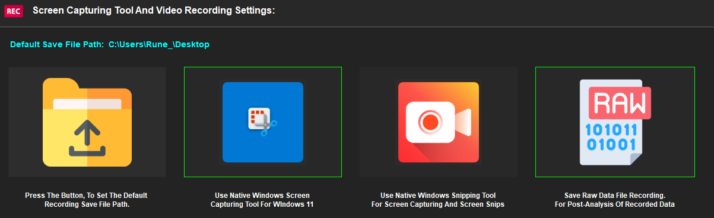

## 3.6 – Temperature Measurements 2D Plot Data Set Settings

The “Temperature Plot Data Set Settings” menu, configures the 2D temperature measurement plots data sets.

A Plot data set, is a 2D plot line configuration, with a Data Source, Line Width and Line Color.

There is a total of 10x data sets available for configuration – meaning that 10x different temperature measurements can be plotted at the same time.

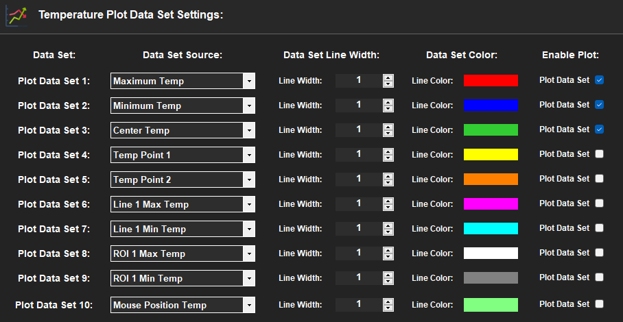

To configure a 2D plot data set:

- Select the Data Set Measurement Source from the drop-down menu list.

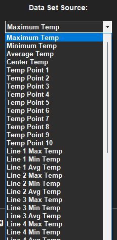

- Configure the Data Set Plot line width.

- Set the desired Data Set Plot line color. Click on the colored panel to open the color selection palette and choose a new color.

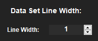 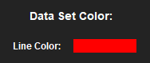

The available Data Set Sources are listed below:

- Maximum Temperature.

- Minimum Temperature.

- Average Temperature

- Center Temperature.

- Temperature Point 1 to Temperature Point 10.

- Line 1 to 5 Maximum, Minimum And Average Temperature.

- Region Of Interest 1 to 10 Maximum, Minimum And Average Temperature.

- Mouse Cursor Temperature.

- Camera Temperature Drift.

To enable the plot of the configured Data Set, check the “Enable Plot” Check-Box.

To disable plotting of the configured Data Set, un-check the “Enable Plot” Check-Box.

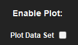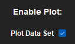

## 3.7 – Data Logging Session Settings

The “Data Logging Session Settings” menu, configures the temperature measurements data logging feature. The data logging is done in sessions of logging data to a CSV file. The session stops after a configured duration, or if stopped manually.

Press the button, to select the default save file location for the data logging session.

The data logging interval, is the interval for each measures sample stored in the CSV file. If the interval is set to a value of 1.00 - which is 1 second, a measurement from each of the enabled Data Sets (refer to section [3.6 – Temperature Measurements 2D Plot Data Set Settings](#36--temperature-measurements-2d-plot-data-set-settings)) will be written and stored in the CSV file.

The Duration Hours, Minutes and Seconds sets the data logging session duration. When the duration expires, then the data logging session stops.

The delimiter character used in the data logging CSV file can also be selected in this menu. The setting is saved and used for every session.

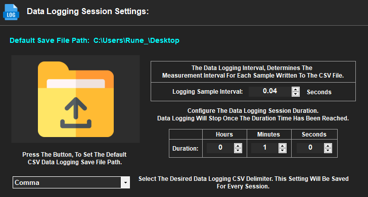

## 3.8 – Temperature Alarms Settings

The “Temperature Alarms Configuration” Menu, configures up to 5x different temperature alarms. The temperature alarms are used for monitoring temperatures above, below or within a certain maximum and minimum temperature threshold.

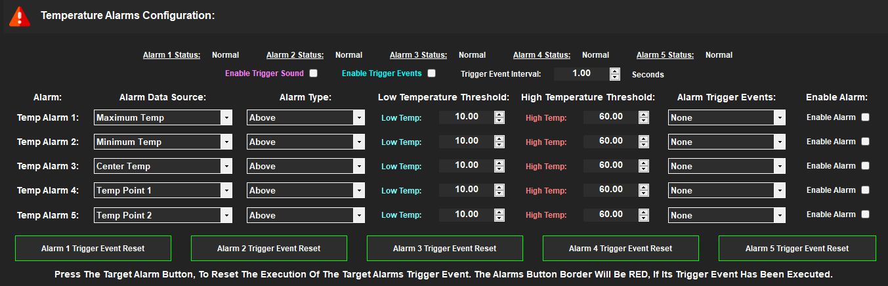

A temperature alarm, has 5 different configuration options:

- <u>Alarm Data Source:</u> Which is the reference temperature measurement associated with the alarm.

- <u>Alarm Type:</u> Is the alarm configuration type. 3 different configurations are available – Above, Below and Window.

  - *Above:* Triggers the alarm if the Source temperature equals or goes above the High Temperature Threshold Value.

  - *Below:* Triggers the alarm if the Source temperature equals or goes below the Low Temperature Threshold Value.

  - *Window:* Triggers the alarm if the Source temperature goes outside the window of the High and Low Temperature Threshold Values.

- <u>Low Temperature Threshold:</u> Is the minimum temperature threshold value for the particular alarm.

- <u>High Temperature Threshold:</u> Is the maximum temperature threshold value for the particular alarm.

- <u>Alarm Trigger Events:</u> Is an event which is executed, whenever the temperature alarm is triggered, With event Reset Button.

Additionally, an alarm sound can be enabled for audio feedback whenever an alarm has been triggered.

The “Enable Trigger Events” Check-Box can be checked/un-checked to enable or disable the alarm trigger events. The “Trigger Event Interval” value, sets the interval for each alarm trigger event to execute. If an alarm has been triggered – the event will execute after each interval period.

The status of the enabled temperature alarms can be monitored. A disabled or active “not triggered” temperature alarm, will show a “normal” status. Where a triggered temperature alarm will show a red “Triggered!” status message.

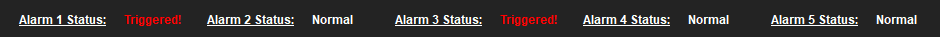

The available temperature alarm Data Sources are listed below:

- Maximum Temperature.

- Minimum Temperature.

- Average Temperature

- Center Temperature.

- Temperature Point 1 to Temperature Point 10.

- Line 1 to 5 Maximum, Minimum And Average Temperature.

- Region Of Interest 1 to 10 Maximum, Minimum And Average Temperature.

- Mouse Cursor Temperature.

To enable the temperature alarm, check the “Enable Alarm” Check-Box.

To disable the temperature alarm, un-check the “Enable Alarm” Check-Box.

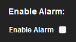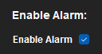

## 3.9 – General And Periodic Trigger Configuration

The “General And Periodic Trigger Event Configuration” menu, provides five different periodic trigger events that can be configured to trigger within a certain time period.

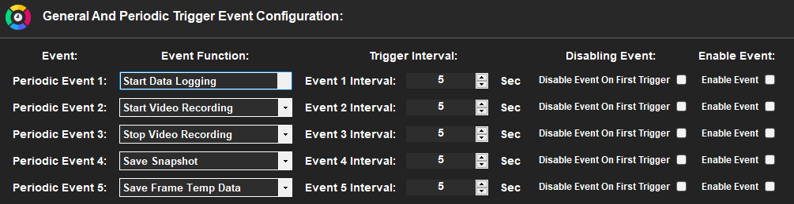

Each of the five periodic triggers can be configured to trigger the following events:

- <u>None</u>: No event is selected (does nothing)

- <u>Start Data Logging</u>: Starts the CSV data logging of the enabled data plot sets.

- <u>Stop Data Logging</u>: Stops the CSV data logging.

- <u>Start Video Recording</u>: Starts the live view stream recording (including the recording of the RAW data, if enabled).

- <u>Stop Video Recording</u>: Stops the live view stream recording.

- <u>Save Snapshot</u>: Saves a live view snapshot (including a RAW snapshot, if enabled).

- <u>Save Frame Temp Data</u>: Saves a full frame temperature data CSV to the configured file path.

Each event can be configured to disable triggering on the first event trigger.

# 4.0 – The Live View Stream

The Live View Stream, shows the live video stream from the connected thermal camera, and allows for manipulation and temperature reading from the captured and processed thermal image.

When a thermal camera has been connected to the application, all additional menu buttons in the left GUI menu panel will light up.

Pressing the “Stream” button, will open the Live View Stream panel window:

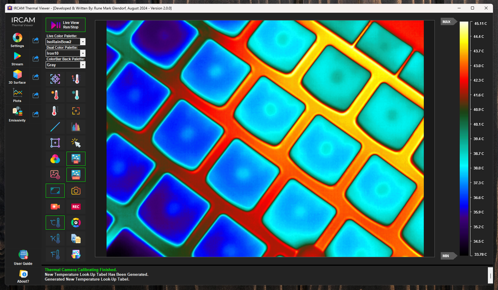

## 4.1 – The Live View Tools Panel

The Live View Tools panel contains the many different options/tools for various manipulation and temperature readings of the displayed thermal image.

### 4.1.1 – Live View Color Palette Selection Dropdown Menus

In the top of the live view tools panel are three dropdown menus. The live view can be configured to use three different color palettes as the same time. Each color palette is used for a specific function.

The three different color palette options are:

1.  The Live View Color Palette (Live Color Palette).

This is the main live view stream color palette and can be changed by selected on of the many different available color palettes in the associated dropdown menu.

2.  The Dual Color Palette Boxes Color Palette (Dual Color Palette)

When the dual color palette box tool feature option is enabled, this dropdown menu is used to set the overlayed dual color palette displayed within the area of the dual color palette box. Use the associated dropdown menu to select between the many different color palette options.

3.  The ColorBars Background Color Palette (ColorBar Back Palette)

This dropdown menu selects the colorbars background palette. This palette is show whenever the user manipulates the temperature range of the main live view color palette using the colorbar arrows. Use the associated dropdown menu to select between the many different color palette options.

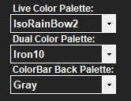

### 4.1.2 – Live View Tools Panel Buttons

The function of each of the live view tools panel buttons are described in the table below:

|  | Press this button to Run/Stop the live view video stream. (Single Trigger using HotKey) |  |  |
|:--:|----|:--:|----|
|  | Perform Non-Uniformity Calibration of the connected thermal camera. |  | Change the high or low temperature range for the connected camera. |
|  | Enable the live view maximum temperature tracking label. |  | Enable the live view minimum temperature tracking label. |
| 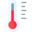 | Enable the live view center temperature tracking label. |  | Add a movable temperature label to the view live stream. |
|  | Add a movable temperature line to the view live stream. |  | Enables the live view histogram. The Histogram is displayed next to the live view colorbar. |
|  | Add a movable ROI (Region Of Interest) box to the live view stream. |  | Enables the label and temperature tracking of the mouse pointer inside the live view stream window. |
|  | Enable the movable live view dual color palette box. |  | Enables the live view stream image ULTRA Resolution feature. |
|  | Enable the sharpening of the live view image. |  | Enables the live view stream image Enhanced Resolution feature. |
|  | Enables the fixed aspect ratio display mode for the live view image. |  | Takes a snapshot of the live view stream (includes saving of a RAW snapshot Data file) |
|  | Press to open the selected native windows screen capturing tool. |  | Starts the recording of the live view video stream (includes the recording of RAW image data) |
|  | Press to set all displayed temperatures to units of Celsius. |  | Enables the general or periodic trigger events. |
|  | Press to set all displayed temperatures to units of Fahrenheit. |  | Saves a full frame temperature data CSV file of the current displayed live view image. |
|  | Press to set all displayed temperatures to units of Kelvin. |  | Show the live view statistics window (section [4.11](#411--live-view-statistics-window)). |

### 4.1.3 – Live View Tool Options HotKeys

The following table lists the different live view HotKeys and combinations:

| HotKey: | HotKey Function Description: | HotKey: | HotKey Function Description: |
|:--:|----|:--:|----|
| 1 | Enable the live view maximum temperature tracking label. | K | Press to set all displayed temperatures to units of Kelvin. |
| 2 | Enable the live view minimum temperature tracking label. | M | Starts CSV Data logging. |
| 3 | Enable the live view center temperature tracking label | N | Stops CSV Data logging. |
| 4 | Add a movable temperature label to the view live stream. | O | Single live view Run/Stop trigger. |
| 5 | Add a movable temperature line to the view live stream. | P | Enables the general or periodic trigger events. |
| 6 | Enables the live view histogram. The Histogram is displayed next to the live view colorbar. | Q | Perform Non-Uniformity Calibration of the connected thermal camera. |
| 7 | Add a movable ROI (Region Of Interest) box to the live view stream. | R | Rotate the live view image 90 degrees clockwise. |
| 8 | Enables the label and temperature tracking of the mouse pointer inside the live view stream window. | S | Takes a snapshot of the live view stream (includes saving of a RAW snapshot Data file) |
| 9 | Enable the movable live view dual color palette box. | T | Change the high or low temperature range for the connected camera. |
| A | Enables the fixed aspect ratio display mode for the live view image. | U | Enables the live view stream image ULTRA Resolution feature. |
| C | Press to set all displayed temperatures to units of Celsius. | V | Starts the recording of the live view video stream (includes the recording of RAW image data) |
| F | Press to set all displayed temperatures to units of Fahrenheit. | X | Enables the live view stream image Enhanced Resolution feature. |
| H | Toggle live view Run/Stop | Y | Enable the sharpening of the live view image. |

## 4.2 – Maximum, Minimum & Center Temperature Measurements

On The Live View Stream, it is possible to enable tracking of the maximum, minimum and center temperatures within the thermal image frame. The temperature labels will update in real time.

Refer to section: [4.1.2 – Live View Tools Panel Buttons](#412--live-view-tools-panel-buttons) on how to enable the tracking of the maximum, minimum and center temperature labels.

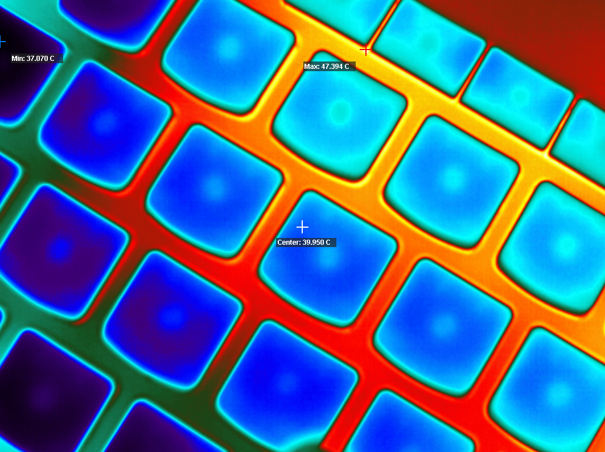

## 4.3 – Adding A Fixed Temperature Measurement Point

On The Live View Stream, it is possible to add a temperature measurement point. Up to 10x different temperature measurements points can be added at the same time.

To add a temperature measurement point, to the Live View Stream, refer to section: [4.1.2 – Live View Tools Panel Buttons](#412--live-view-tools-panel-buttons)

When the button has been pressed a temperature measurement label and cursor will appear on the Live View Stream:

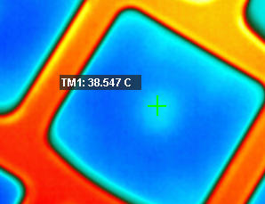

A maximum of 10 temperature measurement points can be added to the Live View. The first three letters in the label text identify the temperature measurement, where TM1 is the first temperature measurement point and TM10 is the last.

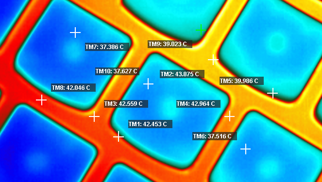

The temperature measurement points are movable. To move a temperature point, place the mouse cursor inside the crosshair of the point. Click to highlight the temperature point and hold the left mouse button to move it to a new location.

To Delete/Remove a temperature measurement point from the Live View Stream. Right-Click on the Live View Stream Panel to bring up the live view context menu. From the context menu the user can delete individual label or all at the same time.

## 4.4 – Adding A Temperature Spectrum Line

On The Live View Stream, it is possible to add a temperature spectrum line. Up to 5x different spectrum lines can be added at the same time.

To add a temperature spectrum line, to the Live View Stream, refer to the section: [4.1.2 – Live View Tools Panel Buttons](#412--live-view-tools-panel-buttons)

When the button has been pressed a spectrum line will appear on the Live View Stream.

The temperature spectrum line will show the maximum and minimum temperatures across the length of the line.

Each temperature spectrum line is movable and its length and position can be adjusted.

To move the line:

- Place the mouse cursor in the middle of the line.

- Click and hold down the left mouse button to highlight and move the line.

- To stretch the line, select and move from one of the line ends.

Up to 5 different temperature spectrum lines can be added to the Live View and temperature values are updated in real time.

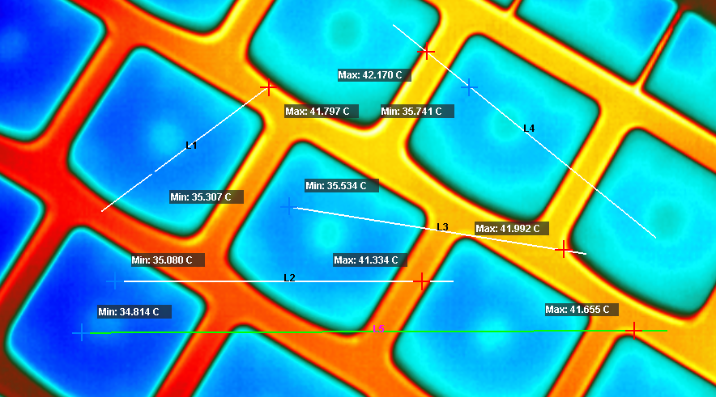

## 4.5 – Adding A Region Of Interest Box

On The Live View Stream, it is possible to add Region of Interest boxes. Also known as ROI boxes. Up to 10x different Region Of Interest boxes can be added to the Live View at the same time.

To add a Region of Interest box, to the Live View Stream, refer to section: [4.1.2 – Live View Tools Panel Buttons](#412--live-view-tools-panel-buttons)

When the button has been pressed a Region of Interest box will appear on the Live View Stream.

The ROI box, is a region within the thermal image, where the maximum and minimum temperatures are tracked. The ROI box data can also be used as the reference data for the temperature Histogram. The ROI feature is a perfect tool for analyzing different regions within a single thermal image.

Each ROI is scalable and movable, and can be sized and moved within the area of the live view stream.

To resize or move an ROI box, simply click and hold to Highlight the ROI and move the selected ROI or ROI box side.

Up to 10 different Regions of Interest boxes can be added to the Live View.

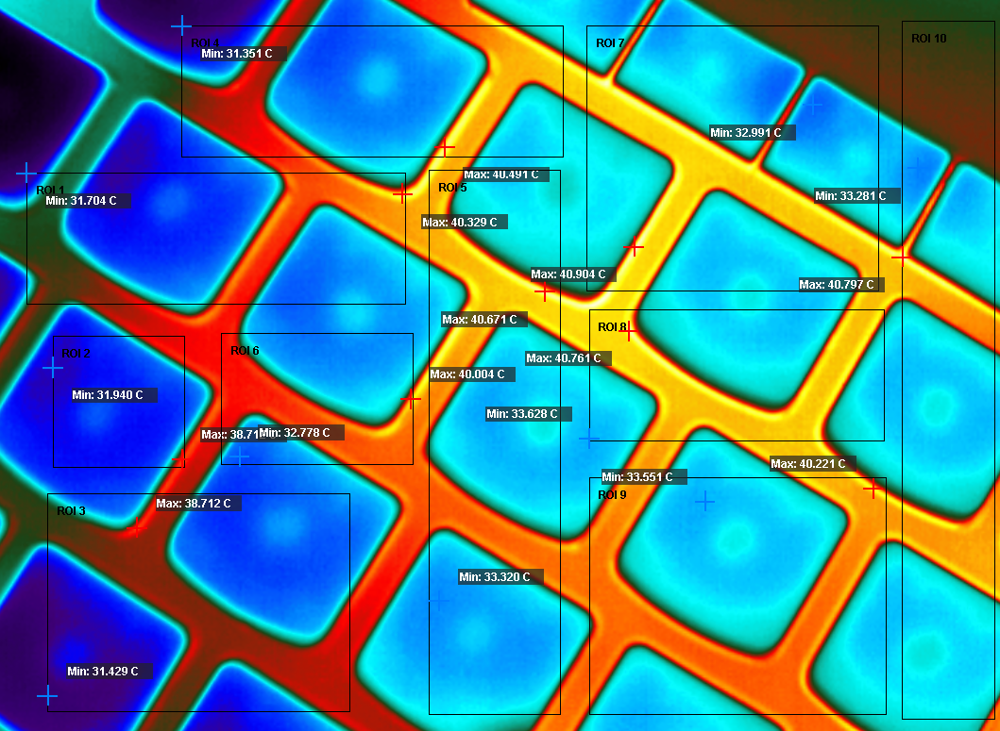

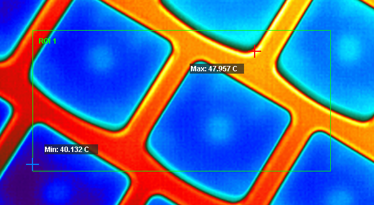

## 4.6 – Mouse Cursor Temperature Tracking

On The Live View Stream, it is possible to enable the tracking of the mouse cursors temperature.

To enable this feature, refer to section: [4.1.2 – Live View Tools Panel Buttons](#412--live-view-tools-panel-buttons)

A temperature label will appear and follow the mouse cursor, displaying the temperature of the pixel that the mouse is pointing to.

This is a very useful feature, to get a quick overview of the different temperatures on the Live View Stream. The displayed label data also includes the cursors X/Y position data.

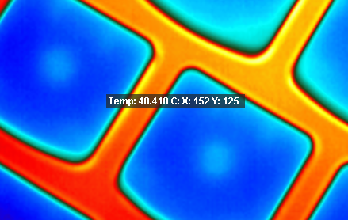

\*The X and Y data can also be used as the pixel reference positions for the saved Full-Frame Temperature CSV data file.

## 4.7 – Live View Color Palettes

The processed thermal image can be displayed within a certain color spectrum, by using specific designed color palettes.

IRCAM Thermal Viewer comes with a lot of different color palettes to choose from. Up to 50+ different color palettes are available.

On the Live View Stream, there are three different color palettes to configure:

- The Live View Color Palette.

  This palette is the main Live View Stream color palette.

- The Dual Color Palette

  This palette is the palette used for the “View Dual Color Palette” feature.

- The Color Bar Background Color Palette.

  This palette is the background palette for the Live View Color Bar. Relevant when changing the Color Bar ranges.

Refer to section: [4.1.1 – Live View Color Palette Selection Dropdown Menus](#411--live-view-color-palette-selection-dropdown-menus) for information on how to change the color palettes.

Different Live View Color Palette examples:

| 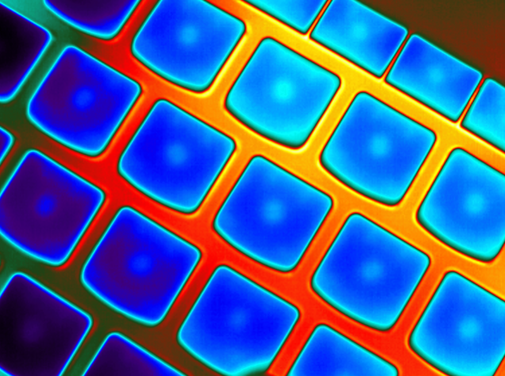 | 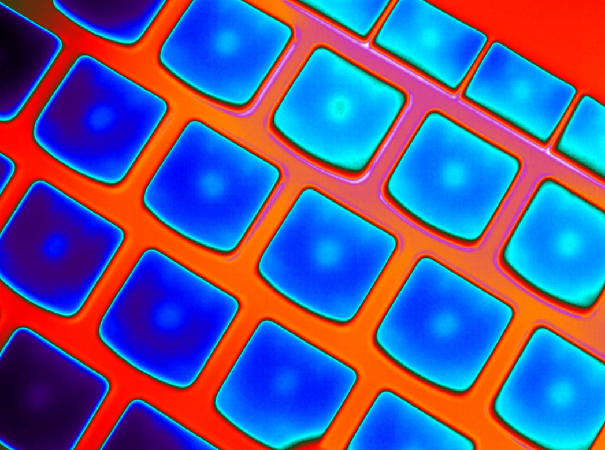 | 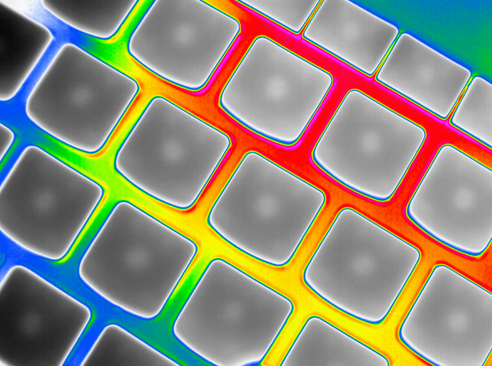 | 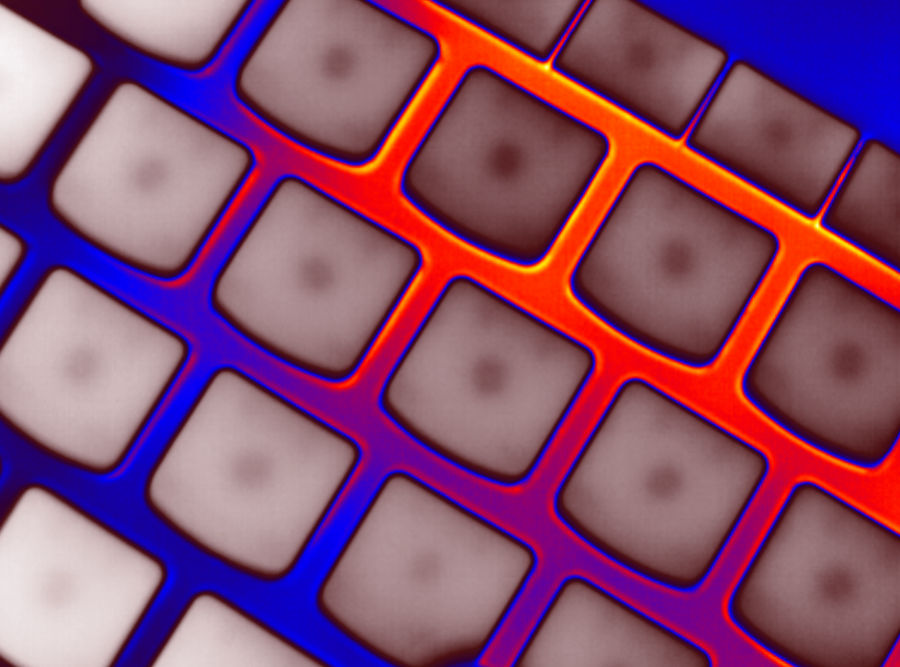 | 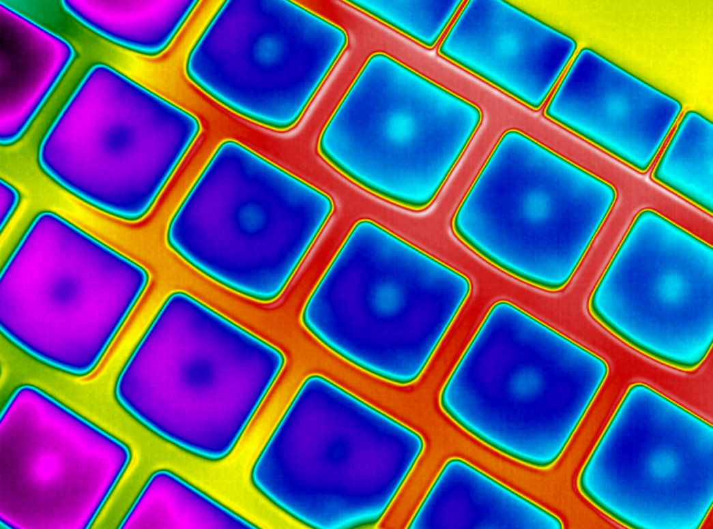 |
|----|----|----|----|----|
|  |  | 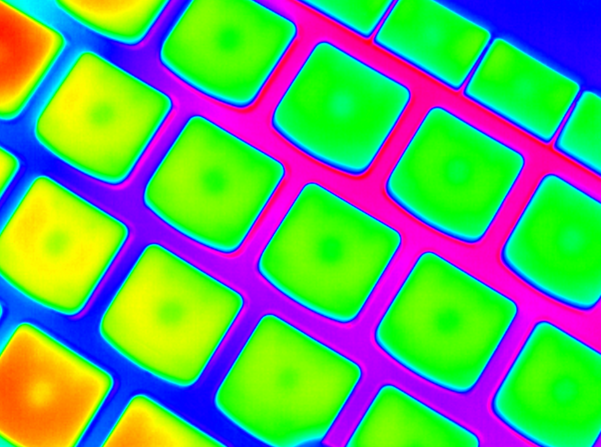 | 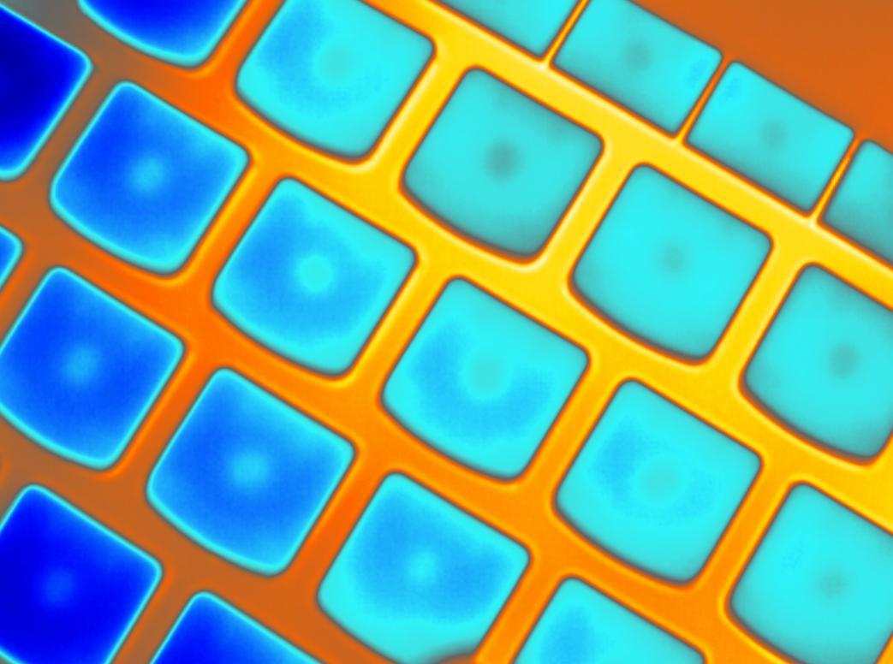 | 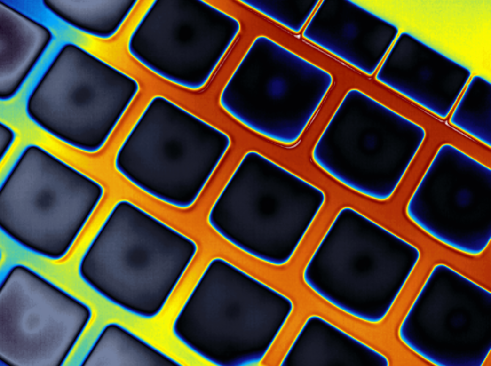 |

## 4.8 – Live View Dual Color Palettes

The Live View Stream features a Dual Color Palette mode, where a scalable and movable box can be inserted onto the Live View Stream and be used as an overlay for a different color palette.

To toggle the Dual Live View Stream color palettes, refer to section: [4.1.2 – Live View Tools Panel Buttons](#412--live-view-tools-panel-buttons)

When the button has been pressed, a movable and scalable dual palette box will appear on the Live View Stream.

To resize or move the dual palette box, simply click and hold to Highlight the box, move the box or a selected side.

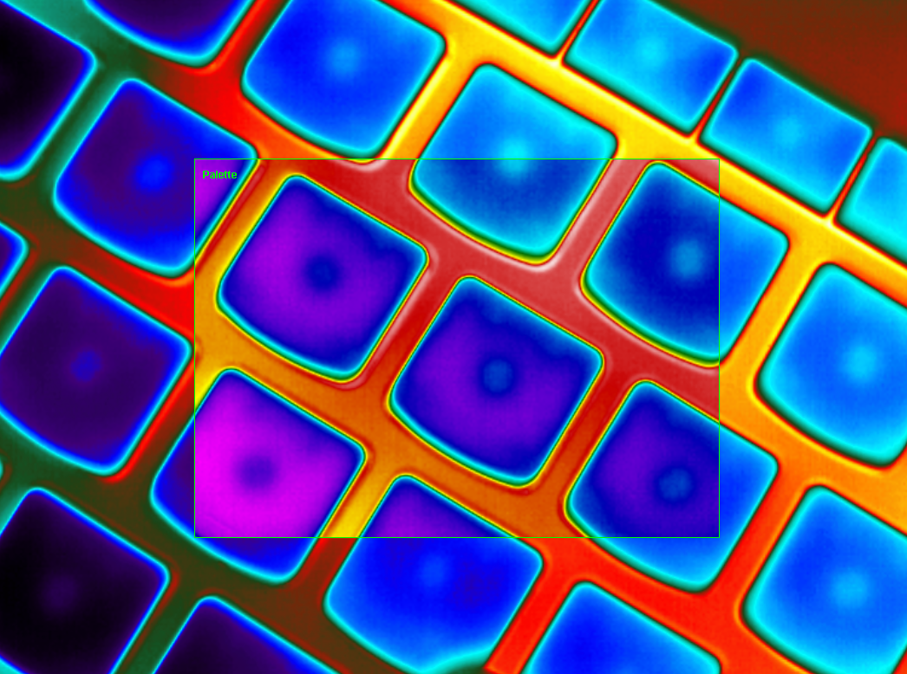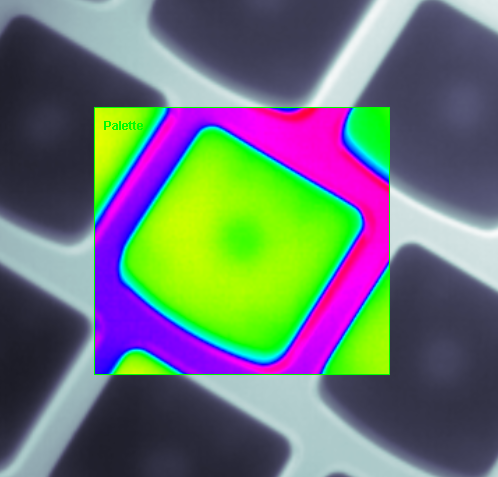

## 4.9 – The Live View Split View

The Live View Split View can be toggled using the live view context menu. Refer to section [4.10 – Live View Stream Context Menu Features & Options](#410--live-view-stream-context-menu-features--options). The Live View Split View Features a zoom feature, where the user can use a ROI on the main live view image, to zoom into areas of interest. The border between the two images can be manipulated by selecting the separator and moving it.

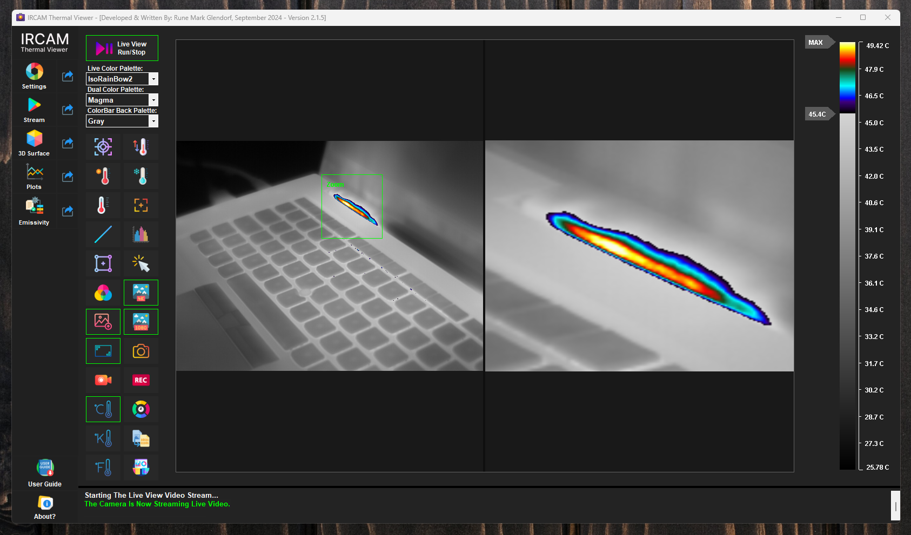

## 4.10 – Live View Stream Context Menu Features & Options

Right clicking on the live view stream will bring up the live view context menu.

Each section of the live view context menu, provides the user with quick access to different ways of manipulating and changing the live view image.

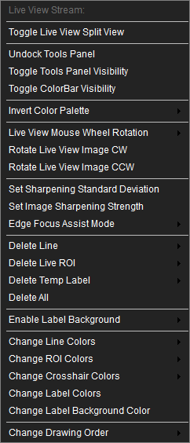

The live view tools panel can be undocked and the visibility of the colorbar and tools panel can set to either hidden or shown.

The different live view color palettes can be inverted, giving even more possible color palette options.

The live view image can be rotated in the clockwise or counter-clockwise direction – useful for cameras having a natural rotated sensor position. It is also possible to enable the mouse scroll wheel to be used to rotate the live view image.

The live view image sharpening strength and deviation can also be changed by the user, to allow for finetuning of the live view image quality. A focus assist mode is also available, where the user can see which parts of the live view image are in focus.

Temperature labels, ROIs and temperature lines can be removed or deleted using these options. The user can choose which element should be deleted or choose the “Delete All” to delete all elements on the entire live view stream.

All temperature labels have their backgrounds enabled by default. This option allows the user to enable or disable the label background.

The user can use these options to change the color of the different live view elements to whatever color combination that makes the best viewable experience. All of the color combinations are saved for every session and can be changed at any time.

The last context menu option, allows for changing the element rendering order. Where, for example, the user can select that ROIs are in front of Temperature Lines and more.

## 4.11 – Live View Statistics Window

The statistics window is opened with the statistics button in the Live View Tools panel (section [4.1.2 – Live View Tools Panel Buttons](#412--live-view-tools-panel-buttons)). It shows live information about the connected camera and the current image:

- Thermal camera name, image width and height, live view frame rate and the number of captured frames.

- Live view temperatures: maximum peak, minimum peak, average, span, range usage, drift and drift error.

- The camera's sensor calibration values 0 to 5.

The "Always In Front" option keeps the window above the main window.

# 5.0 – The Live View Color Bar

The Live View Color Bar visualizes and maps the color temperature range of the thermal image to that of a selected color palette.

The Color Bar is an essential tool for understanding and analyzing the temperature depth and scale of the displayed thermal image.

This section will quickly describe the features of the IRCAM Thermal Viewer ColorBar and how to use them.

| 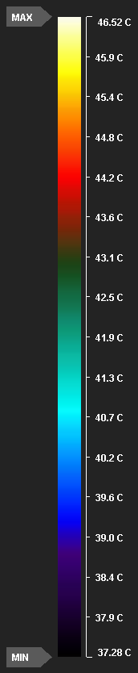 | 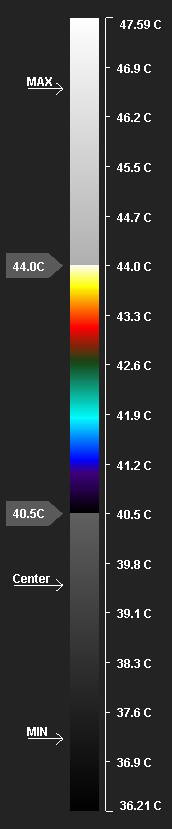 | 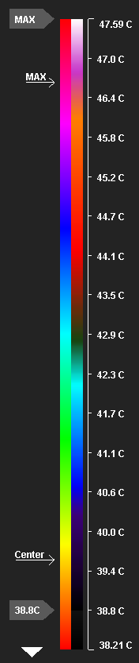 | 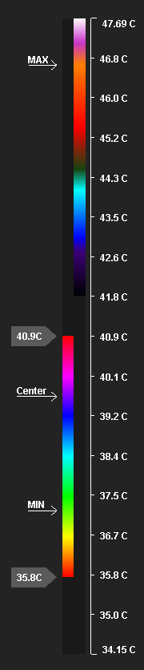 | 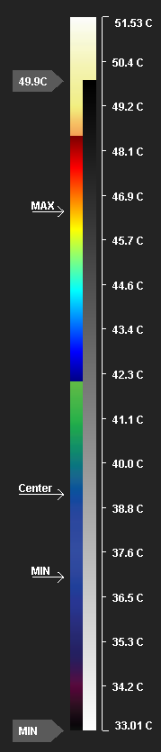 | 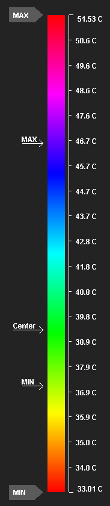 |
|----|----|----|----|----|----|

## 5.1 – The Color Bar Context Menu

Right-Clicking inside the ColorBar area brings up the ColorBar context menu.

The context menu includes many useful features and options, for quick and easy manipulation of the ColorBar data and ranges.

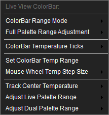

The colorbar range can be switched from Automatic Range and Manual Range using the context menu and vice versa.

The “Full Palette Range Adjustment” option, enables or disables the option to scale the full color palette color range inside the range of the colorbar range arrows.

The colorbars right side temperature label ticks can be changed using this option.

When the colorbar is set to the manual range, the option “Set ColorBar Temp Range” will be enabled for the user to manually set the desired temperature range for the color palette through the use of the input dialog:

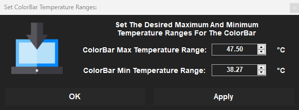

In manual range mode, the user can also use the mouse scroll wheel to change the temperature range. The temperature change per mouse-wheel step is set with the "Mouse Wheel Temp Step Size" option (0.1 to 10 degrees).

An arrow that tracks the center temperature within the colorbar area can be enabled and displayed. Refer to section [5.0 – The Live View Color Bar](#50--the-live-view-color-bar) for an example of how this feature functions.

The last two context menu options, are used to enable or disable the colorbars color palette range adjustments. By default, only the live view color palette is enabled for range adjustment and the dual color palette is disabled for range adjustment.

## 5.2 – Color Bar Manual & Automatic Range Setting

The ColorBar can be configured in automatic or manual temperature range mode. In automatic temperature range mode, the ColorBar will automatically change its maximum and minimum range, depending on the maximum and minimum thermal image pixel temperatures.

In manual temperature range mode, the maximum and minimum range temperatures can be set to any value. This can be done by using the “Set ColorBar Temp Range” option in the Color Bar context menu – or using the mouse wheel.

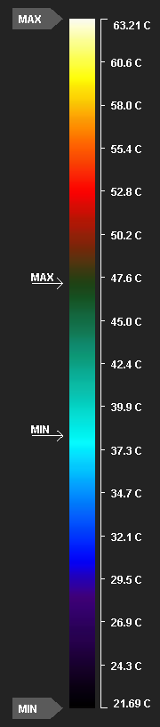

Using the context menu option, will bring up the dialog:


Using the mouse wheel to change the temperature ranges is done by placing the mouse in the TOP or BOTTOM of the Color Bar area – and then scrolling the mouse wheel up or down. This will change the maximum and minimum temperature ranges, depending on the mouse cursor placement.

In manual temperature range mode, a MAX and MIN temperature cursor will appear. This makes it easy to locate the thermal image range within the Color Bar range area.

If the MAX and MIN temperature cursors go outside the maximum or minimum temperature ranges, an “outside” white pointing arrow will appear. This indicates that the MAX and MIN cursors are outside the configured temperature range.

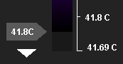 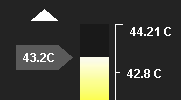

## 5.3 – Color Bar Maximum & Minimum Color Palette Range Sliders (Arrows)

The ColorBar features a maximum and minimum color palette range slider. These sliders set the maximum and minimum temperature ranges for the mapped color palette. This is a very useful feature for isolating or changing focus to certain temperatures on the thermal image. The palette behind the “ranged” palette is the “Background” color palette, which can be changed – Refer to section: [4.1.1 – Live View Color Palette Selection Dropdown Menus](#411--live-view-color-palette-selection-dropdown-menus)

The maximum and minimum color palette range slider will show MAX/MIN, if they are at the maximum or minimum ranges (Top and Bottom of the ColorBar) - Else, they will show the placement temperature.

To change the sliders positions, simply Click-&-Hold and slide the arrow to a new position of the ColorBar, as shown below:

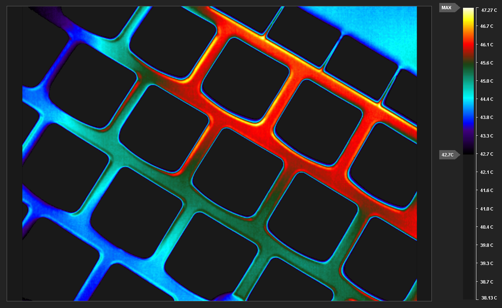

# 6.0 – The Live View Histogram

The Live View Stream includes a feature to display a real-time updating thermal image histogram. The histogram shows the thermal image pixel intensity distribution across the whole thermal image frame. This results in a thermal spectrum, which is an extremely useful tool for analyzing the temperature distribution of the thermal scene.

The Live View Histogram can be enabled and shown by clicking on the associated live view tools panel button.

Refer to section: [4.1.2 – Live View Tools Panel Buttons](#412--live-view-tools-panel-buttons)

The Histogram will be shown on the left side of the Color Bar – and the temperature distribution corresponds to that of the Color Bar range. The histogram color palette and palette range, will follow that of the Color Bar.

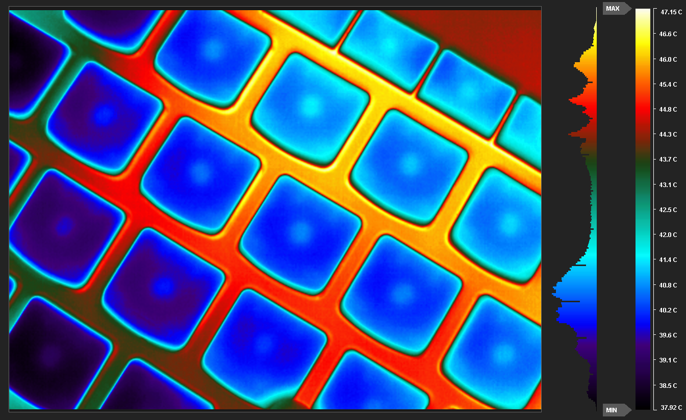

## 6.1 – The Histogram Context Menu

Right-Clicking inside the Histogram area brings up the Live View Histogram context menu.

The context menu includes useful features and options, for quick and easy configuration of the Live View Histogram.

The “Histogram Source” option, is used to select the data source for the histogram data. This is explained in the section below.

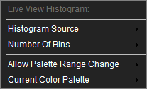

The number of histogram bins can also be changed, to allow for a wider or narrower distribution.

The option “Allow Palette Range Change” enables or disables the histograms palette range adjustment.

The histogram color palette can be selected to be either the live view palette or the dual palette.

## 6.2 – Changing The Histogram Data Source

The Live View Histograms data source can be changed to different sources. The ROIs (Refer to section: [4.5 – Adding A Region Of Interest Box](#45--adding-a-region-of-interest-box)) or the Spectrum Lines (Refer to section: [4.4 – Adding A Temperature Spectrum Line](#44--adding-a-temperature-spectrum-line)) can be used as the reference data for the Live View Histogram.

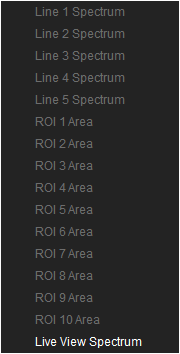

When a different data source is used, the histogram will only display the data associated with the selected data source. The histogram source data will be updated in real time and if the data source element is deleted, then the histogram will continually display the last element position source data.

To select a new data source: Simply select a new Histogram data source from the context menu (Refer to the section: [6.1 – The Histogram Context Menu](#61--the-histogram-context-menu)). Note, that at least one ROI or Spectrum Line must be active on the Live View Stream to set it as the Histogram source. The histogram will immediately update to show the new data source spectrum.

All enabled and available histogram data sources will be reflected in the “Histogram Source” context menu.

For ROIs and Lines, changing the size of the element will automatically update the histogram data.

# 7.0 – The Thermal 3D Surface Plot

The IRCAM Thermal Viewer software application, features a 3D surface plot feature. The 3D surface plot shows the 3D thermal radiation environment depth. This is an extremely useful feature, for advanced thermal analysis of objects and thermal environments. The 3D Surface Plot can be rotated, scaled and moved using a Mouse or a Touch-Screen.

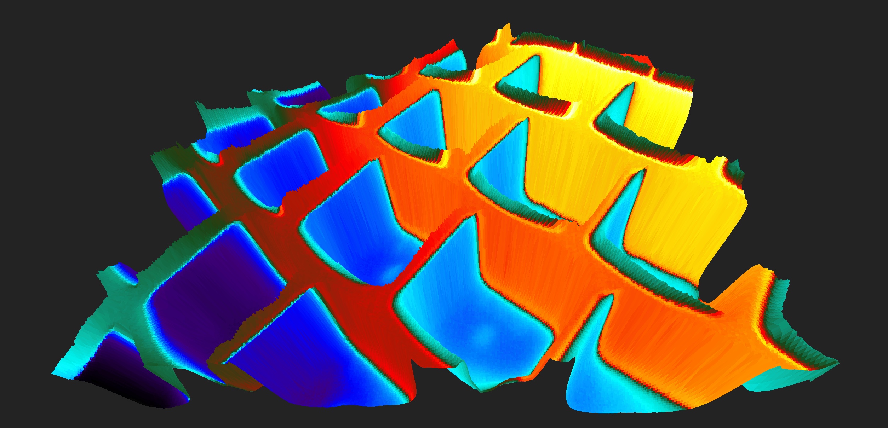

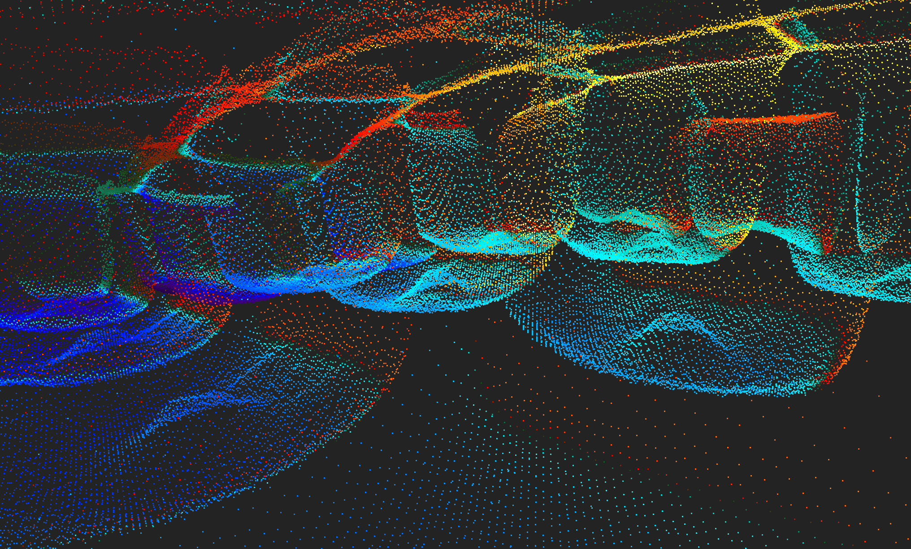

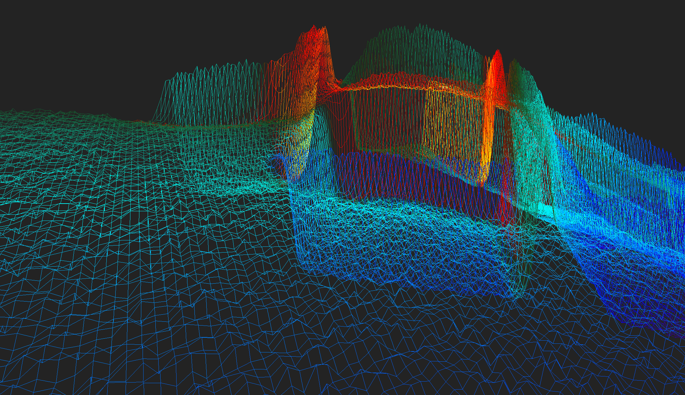

## 7.1 – The Thermal 3D Surface Plot Context Menu

Right-Clicking inside the 3D Surface Plot area brings up the 3D Surface Plot context menu.

The context menu includes useful options, for quick and easy configuration/manipulation of the 3D Surface Plot.

In the context menu, the user can select the option to display the 3D surface plot as filled polygons, where the 3D surface amplitude is mapped to each polygon. The 3D surface plot can also be selected to be displayed as points or lines.

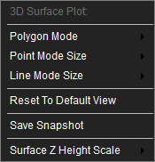

The Point and Line Mode Size options sets the size of the rendered 3D surface plot lines and points in their respected modes.

A snapshot of the 3D surface plot can be saved by clicking the “Save Snapshot” option in the context menu.

The user can also change the scale of the displayed 3D Surface plot Z height, and "Reset To Default View" returns the plot to its starting position.

## 7.2 – Manipulating The 3D Surface Plot

The user can use a touch-screen, trackpad or a connected mouse to manipulate the 3D surface plot to any position within the GUI window. The table below describes the mouse button features for manipulating the 3D Surface Plot:

|  | Hold the left mouse button to adjust the X and Z positions of the 3D surface Plot. |
|:--:|:--:|
|  | Hold the mouse scroll wheel to adjust the whole 3D Surface Plots X and Y position inside the GUI window. |
|  | Hold the right mouse button to rotate the 3D surface Plot around the Y axis. |

\*Note: For touch screens, the mouse wheel is reassigned as a three-finger touch.

# 8.0 – The 2D Temperature Measurements Plot

The IRCAM Thermal Viewer software application, features a 2D temperature measurements plot. Up to 10x different temperature measurements can be plotted and shown at the same time (Refer to the section: [3.6 – Temperature Measurements 2D Plot Data Set Settings](#36--temperature-measurements-2d-plot-data-set-settings)) Combined with the data logging feature (Refer to section: [3.7 – Data Logging Session Settings](#37--data-logging-session-settings)) this results in a very useful tool for viewing, logging and analyzing thermal data over time.

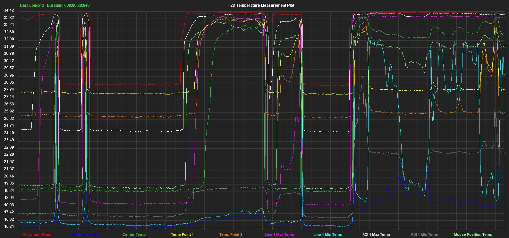

## 8.1 – The 2D Temperature Measurements Plot Context Menu

Right-Clicking inside the 2D Temperature Plot area brings up the 2D Measurements Plot context menu.

The context menu includes useful options and settings, for quick and easy configuration of the 2D temperature Plot.

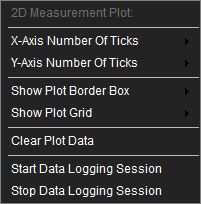

The 2D measurement plots X/Y-Axes number of ticks can be changed using this context menu, allowing for a tighter 2D Plot grid.

By default, the plot border box is visible, but can be disabled by the user if needed.

By default, the plot grid is visible, but the grid can also be disabled by the user if needed.

Use this option to reset/clear the current measurement data (This does not affect the data during data logging).

The user can use these options in the context menu to start or stop the data logging session. A keyboard HotKey is also available for these functions. Refer to section: [4.1.3 – Live View Tool Options HotKeys](#413--live-view-tool-options-hotkeys)

## 8.2 – 2D Measurements Plot Mouse Cursor Label

The 2D measurement plot features a mouse cursor label to view relevant plot data across the plot area. Just left-click inside the area of the 2D plot area to toggle the label, as illustrated in the table below:

|  | Left Click the mouse button to toggle the 2D Measurement Plot data label |
|----|----|

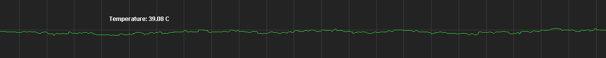

# 9.0 – The Emissivity Table

The IRCAM Thermal Viewer software application, has a built-in table of the most common materials and their emissivity values. The table is a great reference when measuring temperature from different objects.

Double-Clicking on one of the materials or values, will apply the selected emissivity value to the temperature calculations and temperature configuration of the connected thermal camera.

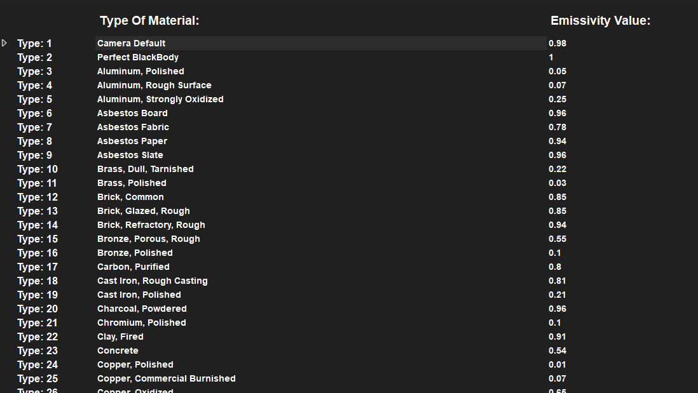

# 10.0 – Recording Analysis Mode

Using the live view RAW video recording feature, the user can record RAW thermal data for post-processing/analysis using the IRCAM Thermal Viewer Software’s “Recording Analysis mode”. This section will describe how to record RAW video data and how to use the recorded data to do post-analysis of important captured thermal event data.

To record live view video, please refer to the sections: [3.5 – Screen Capturing Tool And Video Recording Settings](#35--screen-capturing-tool-and-video-recording-settings) and [4.1.2 – Live View Tools Panel Buttons](#412--live-view-tools-panel-buttons)

When a recording session has been stopped by the user, two files will be saved to the configured save path:

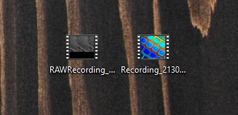

The file with the name “Recording\_...” is the recorded processed video file. The file named “RAWRecording\_...” is the RAW thermal data recording from the connected thermal camera.

The “RAWRecording\_...” recording file is the file the user can re-open in the IRCAM Thermal Viewer Software to do post-processing of the captured thermal data.

## 10.1 – How To Open And Analyze RAW Video Files

The following steps describe how to post-analyze recorded RAW thermal data:

- In the “Connect To A Thermal Camera” panel in the Settings GUI menu, use the same dropdown menu used to select a thermal camera, to select the option “Recording Analysis Mode”.

- When the mode has been selected, the button will display “Click To Browse And Open Video File”.

- Click the button, browse and open the recording video file with the name “RAWRecording\_...”:

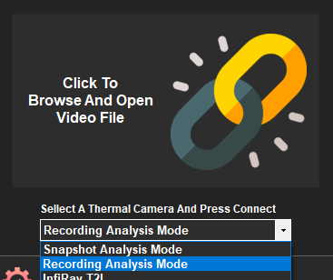

- If the selected video file format is a valid IRCAM_RAW video file, then the video file will be opened and the button will read:

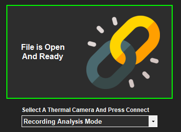

- A “Video Playback Controls” GUI window will automatically open. This window is used to manipulate the opened video file, by either playing or stepping through each frame of the recorded video file. Additional relevant video information is also displayed in the Playback GUI.

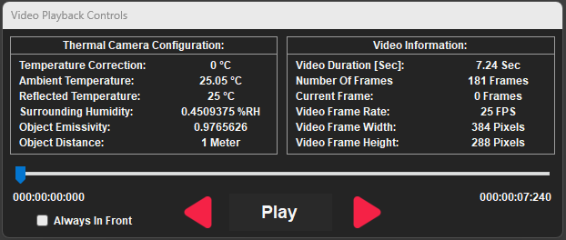

- The user can now post-analyze the data as if a normal thermal camera was connected.

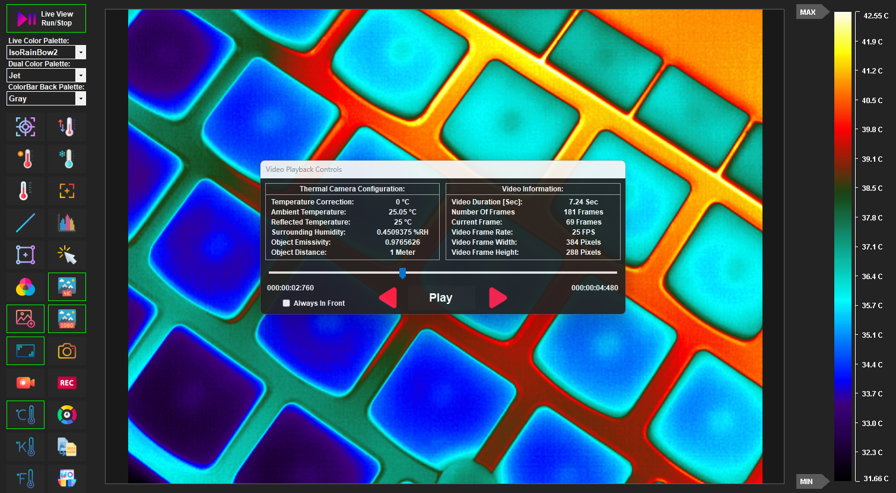

# 11.0 – Snapshot Analysis Mode

Using the live view RAW snapshot capturing feature, the user can capture a RAW thermal data snapshot for post-processing/analysis using the IRCAM Thermal Viewer Software’s “Snapshot Analysis mode”. This section will describe how to capture a RAW snapshot and how to use the captured RAW snapshot to do post-analysis of important captured thermal event data.

To capture a live view RAW snapshot, please refer to the section: [3.4 – Full Temperature Frame Data CSV And Snapshot Settings](#34--full-temperature-frame-data-csv-and-snapshot-settings) and [4.1.2 – Live View Tools Panel Buttons](#412--live-view-tools-panel-buttons)

When the live view tools panel snapshot button has been pressed by the user, two files will be saved to the configured save path:

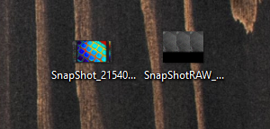

The file with the name “SnapShot\_...” is the captured processed snapshot file. The file named “SnapShotRAW\_...” is the RAW thermal data snapshot from the connected thermal camera.

The “SnapShotRAW\_...” file, is the file the user can re-open in the IRCAM Thermal Viewer Software to do post-processing of the captured thermal data.

## 11.1 – How To Open And Analyze RAW Snapshot Files

The following steps describe how to post-analyze captured RAW thermal snapshot data:

- In the “Connect To A Thermal Camera” panel in the Settings GUI menu, use the same dropdown menu used to select a thermal camera, to select the option “Snapshot Analysis Mode”.

- When the mode has been selected, the button will display “Click To Browse And Open SnapShot File”.

- Click the button, browse and open the captured RAW snapshot file with the name “SnapShotRAW\_...”:

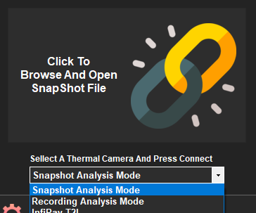

- If the selected snapshot file format is a valid IRCAM_RAW snapshot file, then the snapshot file will be opened and the button will read:

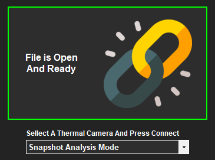

- Now the snapshot data has been loaded to the live view screen and the user can now analyze the captured snapshot data as if a normal thermal camera was connected.

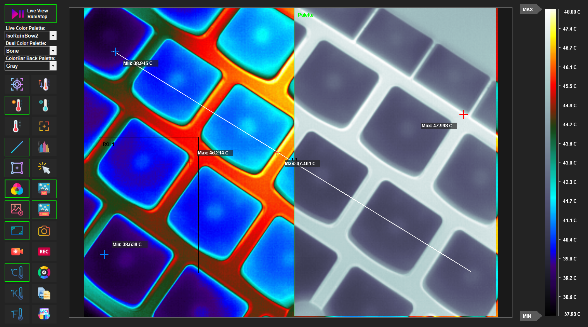

# 12.0 – Reading The Data Logging File Using MATLAB

The following MATLAB code reads an IRCAM data logging CSV file and plots it. The same code is in
`examples/matlab/IRCAMDataLoggingCSVReadExample.m` in the source repository.

```matlab
%% Example On How To Read The IRCAM Data Logging CSV File Using MATLAB

% Clear Command Window & Plots
clc, clf

% In the following example the Data in the data logging file is:
% (Temperature Unit: Celsius)

% Sample,Time(ms),Maximum Temp,Minimum Temp,Average Temp
% 1,40,48.89817,38.09403,41.85327
% 2,80,48.89817,38.09403,41.85327
% 3,120,48.89817,38.09403,41.85327
% 4,160,48.89817,38.09403,41.85327
% 5,200,48.88084,38.05575,41.90866
% 6,240,48.88084,38.07489,41.90866
% 7,280,48.86350,38.07489,41.87173
% 8,320,48.88084,38.07489,41.90866
% 9,360,48.88084,38.07489,41.87173
% ................

% -------------------- Data Logging File Path -------------------- %

% Select the Data Logging File With The Name "DataLogSession_XXXXXXXXXXXXXXXXX"

% Path for the Data Logging file
FileLocation = 'DataLogSession_11545929822082024.txt';

% The Format Of The File Time Stamp Is: hhmmssfffddmmyyyy
% For The Above File Name, The File Was Captured:
% Time: 11:54:59.298, Data: 22-08-2024

% ---------------------------------------------------------------- %

% Read the data from the file, separated by each header description
FileData = readtable(FileLocation);

% Plot Maximum, Minimum And Average Temperature Data
% "/ 1000" -> Conversion To Seconds
plot(FileData.Time_ms_ / 1000, FileData.MaximumTemp, ...
     FileData.Time_ms_ / 1000, FileData.MinimumTemp, ...
     FileData.Time_ms_ / 1000, FileData.AverageTemp);

% Change The Plots X/Y Tick Format
xtickformat('%,.0f');
ytickformat('%,.2f');

% Display Plot Grid
grid on
grid minor

% Add Plot X/Y and Title Labels
xlabel('Time [Sec]', 'FontSize', 14);
ylabel('Temperature [°C]', 'FontSize', 14);
title('IRCAM CSV Data Logging Temperature Plot', 'FontSize', 16);

% Add Plot Legende
legend('Maximum Temperature', 'Minimum Temperature', 'Average Temperature');
```

The code produces the plot below:

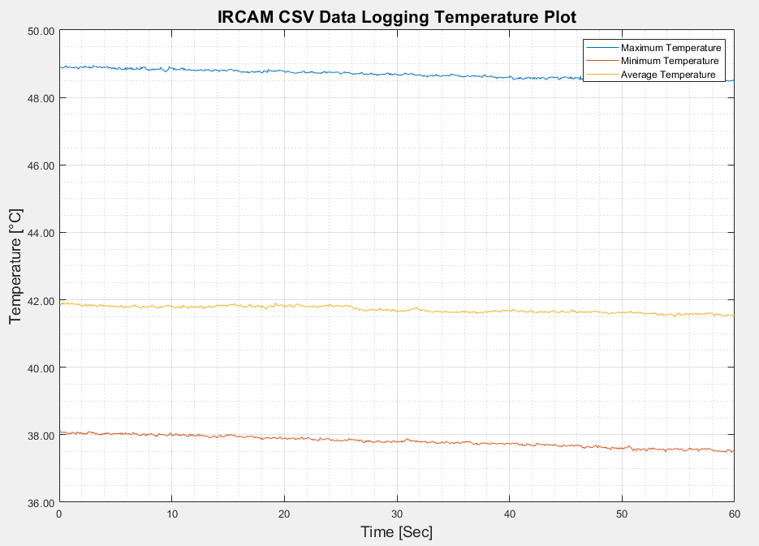

# 13.0 – Reading The Full Frame Temperature Data File Using MATLAB

The following MATLAB code reads an IRCAM full frame temperature data CSV file and shows it as an image, a 3D surface
and a histogram. The same code is in `examples/matlab/IRCAMFullFrameTempCSVReadExample.m` in the source repository.

```matlab
%% Example On How To Read The IRCAM Full Frame Temperature Data CSV File Using MATLAB

% Clear Command Window & Plots
clc, clf

% Read the Full Frame Temperature CSV Data File From IRCAM
CSVTempFrameData = readtable('FrameTempData_13565268609092024.txt');

% Allocate the Temperatur data
TemperatureData = CSVTempFrameData.Variables;

% Apply ColorMap For Diaplayed Data
colormap turbo;

% ----------------- Display Data As Normal Image ----------------- %

% First Subplot (Top Left)
subplot(2, 2, 1); % 2 Rows, 2 Columns, 1st Subplot
MaxDataRange = max(max(TemperatureData));
MinDataRange = min(min(TemperatureData));
imagesc(TemperatureData, [MinDataRange, MaxDataRange]);
title('Temperature Data As Image (Auto Range):');
c = colorbar;
c.TickLabels = arrayfun(@(x) sprintf('%.1f °C', x), c.Ticks, 'UniformOutput', false);

% ------ Display Data As Normal Image (Temp Range Adjusted) ------ %

% Second Subplot (Top Right)
subplot(2, 2, 2); % 2 Rows, 2 Columns, 2nd Subplot
MaxDataRange = 85; % In Celsius
MinDataRange = min(min(TemperatureData));
imagesc(TemperatureData, [MinDataRange, MaxDataRange]);
title(['Temperature Data As Image (Manual Range): Max: ' num2str(MaxDataRange) '°C']);
c = colorbar;
c.TickLabels = arrayfun(@(x) sprintf('%.1f °C', x), c.Ticks, 'UniformOutput', false);

% ---------------- Display Data As 3D Surface Plot --------------- %

% Third Subplot (Bottom left)
subplot(2, 2, 3); % 2 Rows, 2 Columns, 3rd Subplot
surf(TemperatureData,'LineStyle','none');
xlabel('Width');
ylabel('Height');
zlabel('Temperature [°C]');
title('3D Surface Plot:');
c = colorbar;
c.TickLabels = arrayfun(@(x) sprintf('%.1f °C', x), c.Ticks, 'UniformOutput', false);

% -------------------- Display Data Histogram -------------------- %

% Fourth Subplot (Bottom Right)
subplot(2, 2, 4); % 2 Rows, 2 Columns, 4th Subplot
histogram(TemperatureData, 64);
xlabel('Temperature [°C]');
ylabel('Accumulation [Samples]');
title('Temperature Data Distribution Histogram:');
grid on, grid minor

% ---------------------------------------------------------------- %
```

The code produces the plots below:

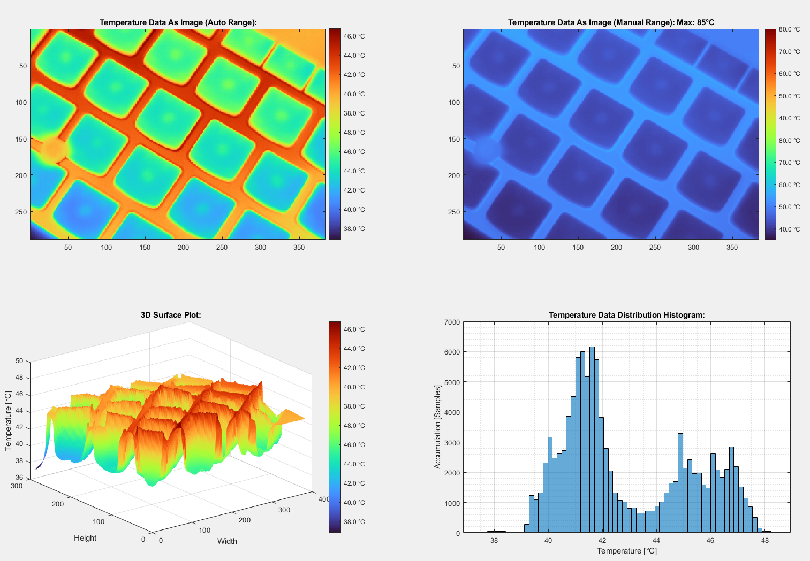
